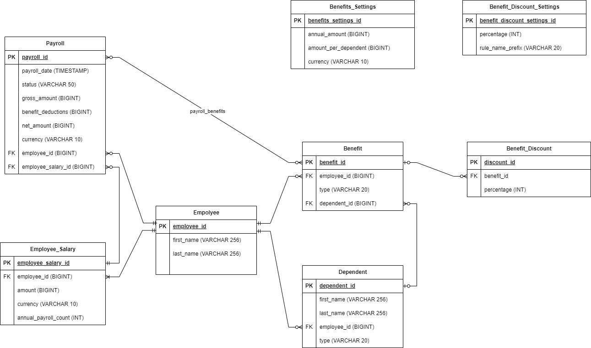

# Business requirements

* One of the critical functions that we provide for our clients is the ability to pay for their employees’ 
benefits packages. A portion of these costs are deducted from their paycheck
* The cost of benefits is $1000/year for each employee
* Each dependent (children and possibly spouses) incurs a cost of $500/year
* Anyone whose name starts with ‘A’ gets a 10% discount, employee or dependent
* Employees may use one or more devices to choose their benefits package as part of a multi-step process that involves 
inputting dependents and need a preview of the costs
* Administrators need to preview payroll before it is run to double check the numbers.
* The costs may change in between, so the calculation needs to reflect the current state of the calculation, 
rather than the state at the time the employee entered it.

# Assumptions

* All employees are paid $2000 per paycheck before deductions
* There are 26 paychecks in a year
* Benefit discount is cumulative. If both, the employee's name and their dependent's name start with `A` a discount 
is applied to both benefits associated with the employee/dependent.
* All amounts are in **US Cents**. This simplifies any arithmetic operations on the backend and enables simple scaling 
of the application to multiple currencies support
* I assume that a new Payroll object is created automatically by the system after the last Payroll has been completed. 
So there is always exactly one payroll instance in the `DRAFT` state for each employee.
* The discount is applied if the employee's or dependent's **first name** starts with `A`

# Guiding principles

* Since we're dealing with finances/payroll domain a full backwards auditability of the benefits and payroll records is required. 
This will have an impact on the data store architecture as we will have to keep separate versions of all source data used for 
benefits / payroll calculations over the course of time. 
* The total benefits' costs are configured via a settings object. This allows for simple change of the benefits' costs in the course of the year.
* In relation to the previous point, and to the following business requirement: `The costs may change in between, 
so the calculation needs to reflect the current state of the calculation, rather than the state at the time the employee entered it` 
all individual benefit deductions and the total deduction cost per payroll have to be calculated on-demand rather than 
persisted in the database.

# Data model

* Please note, some entity attributes are obsolete and they haven't been implemented 

# API Design

## Dependents API
### POST /dependents
* Creates a new dependent.

## Benefits API
### POST /benefits
* Creates a new benefit
* A dependent must exist before a Benefit is created associated with this dependent

### GET /benefits/employee/{employeeId}
* Retrieves all benefits for an employee

## Payrolls API
### GET /payrolls/employee/{employeeId}?payrollStatus=DRAFT|COMPLETED
* Retrieves all payrolls in the specified `payrollStatus` for an employee
* `payrollStatus` is a required parameter with the following allowed values: `DRAFT`, `COMPLETED` 

